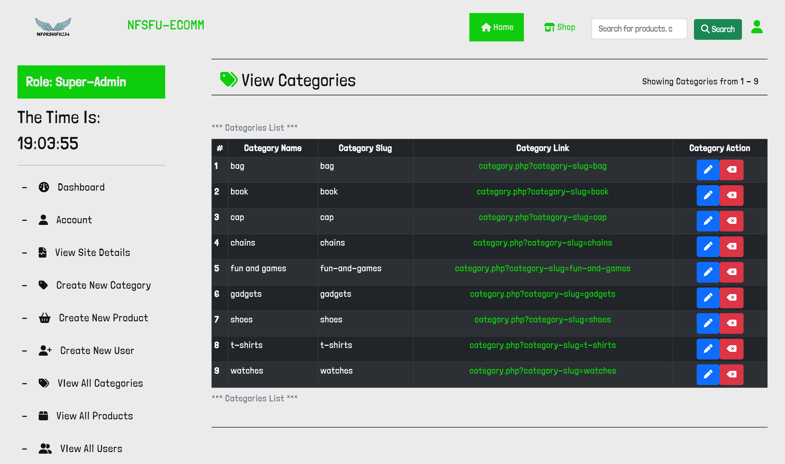

## <h1 align="center" style="padding-top:1em;padding-bottom:1em;" >WELCOME TO <b>NFSH-ECOMM v1.0.0-alpha</b>  by <a target="_blank" href="https://www.instagram.com/nforshifu234dev/" style="color:lightblue;" >NFORSHIFU234 Dev CODES</a>
</h1>

## <h1>ABOUT NFSH-ECOMM v1.0.0-alpha </h1>

NFSH-ECOMM is an E-Commerce website package application for small startups. which they can easily just run the installation and go on with thier sales without having to worry about simple issues. Regarding performances, data update across servers, etc.

This project is just an idea to test my skills in Web Devlopment.

## <h1 id="toolsUsed">TOOLS USED TO BUILD NFSH-ECOMM v1.0.0-alpha </h1>

<ul>

<li>
	Bootstrap ~ This frontend framework was used to generate the underlaying responsive User Interface of the whole application
</li>

<li>
	Native CSS ~ This frontend framework
</li>

<li>
	Vanilla PHP ~ The core language and tool powering the whole backend and data transmition. This app will run on all PHP versions.
</li>

<li>
	JQuery v3.6.3 ~ To Use along side Bootstrap
</li>

<li>
	Vanilla JS ~ For Basic Events, like AJAX request, login validation messeges, etc
</li>

<li>
	Fonts Awesome v6.2.1 ~ For the icons.
</li>

<li>
	Marked JS v3.3.0 ~ For converting our ReadMe.md file to HTML Contents.
</li>

<li>
	MySQL ~ For storing data in the database
</li>

<li>
<h3>Font's Used</h3>

	- The font used for the FRONT END ( the pages where the customers can see is <b>Asap-SemiBold</b> )

	- The font used for the BACK END ( the pages where the admins can see the dashboard is <b>LondrinaSolid-Light</b> )

</li>

</ul>

## <h1 id="features">FEATURES OF NFSH-ECOMM v1.0.0-alpha </h1>

NFSH-ECOMM v1.0.0-alpha features are listed below: 

<ul>

<ul>

<h2>
<b>User Features</b>
</h2>

<li>
	Home Page to display Recent Products
</li>

<li>
	The sidebar which shows random products and categories to view products from.
</li>

<li>
	About Us Page 
</li>
	
<li>
	Contact Us Page
</li>

<li>
	Privacy Policy Page
</li>

<li>
Terms and Conditions Page
</li>
	
<li>
	Shop Page to display all products in stock
</li>

<li>
	Search Page to search for products
</li>

<li>
	Category Page to view all products under a specific category
</li>

<li>
	Single Product View Page to view the detils of a product
	
	<
		------ Features ------
		->	Changes the hero image to any of the product images on click
		->	Edit Product Button if admin is logged in
		-----------------------
	>

</li>

<li>
	Login
</li>

<li>
	Logout
</li>

<h2>
<b>All Admin Features</b>
</h2>

<li>
	Create Product
</li>

<li>
	Create Categories

</li>

<li>
	Create Users

</li>

<li>
	View Product
</li>

<li>
	View Categories

</li>

<li>
	View Users

</li>

<li>
	View Site Information
</li>

<li>
	Edit Site Information status
</li>

<li>
	Login
</li>

<li>
	Logout
</li>

</ul>

</ul>

## <h1 id="partI">PART I - INSTALLATION</h1>
## <h2>How To Install NFSH-ECOMM</h2>

<ol>

<li>
Extract the file from the .rar file to your prefered location in your htdocs folder or www folder
</li>

<li>
Open your browser and navigate to the folder (Example: If I extracted it to my htdocs folder on XAMPP Apache Server, then I will navigate to 
	"localhost/NFSFU-ECOMM/")

</li>

<li>
Follow The Installaton Process and provide the neccessary information asked.
</li>

<li>
After the installation is successful, you will be redirected to the coming soon page. 
</li>

<li>
Click on the dashboard button at the top menu. Once you are in the dashboard page, you can read steps on how to go about the application. To do this this is the first option with the title "Installation Guide" of your dashboard page.
</li>

<li>
By default, the visibility status of the site is set to the "COMING SOON" status. To change that see "<a target="_blank" href="#partII">Part II</a>"
</li>

<li>
 If you wish to add products see "<a target="_blank" href="#partIII">Part III</a>" for more information, if you wish to add categories, see "<a hre="#partIV">PART IV</a>", if you wish to add users, see "<a target="_blank" href="#partV">PART V</a>"
</li>

<!-- <li>

</li>

<li>

</li>

<li> -->

</li>

</ol>

## <h1 id="partII">PART II - VISIBILITY STATUS</h1>
<ul>

<li>

 <h2>There are 4 VISIBILITY STATUS which are Active, Coming Soon, Maintainance and Offline. </h2>

 <ul>

<li>
	<h3>ACTIVE</h3>

		The ACTIVE visibility status is the state where the site is opened to the users to view the products in stock and do their shopping.
	

</li>

<li>
<h3>COMING SOON</h3>

		The COMING SOON visibility status is the state where the site is opened to the users but the site has not been fully opened for buisness. 
	

</li>

<li>
	<h3>MAINTAINACE</h3>

		The MAINTAINACE visibility status is the state where the site is under maintainance. For example updating the codes of the site or the hardware infrastructures, etc
	

</li>

<li>
	<h3>OFFLINE</h3>

		The OFFLINE visibility status is the state where the site services to the users are restricted and the pages are not displayed.
	

</li>

 </ul>

</li>

<li>

<h2>How to change your site VISIBILITY STATUS</h2>

<ol>

To change the visibility status of your site, follow the steps below

<li>
Login into your Super Admin account
</li>

<li>

Navigate to "SITE INFORMATION" page. You can find the link on the side navigation or the third option of your dashboard page.
</li>

<li>
Click the edit icon (pen icon) and click the dropdown to change your staus

</li>

</ol>

</li>

</ul>
		
## <h1 id="partIII">PART III - CREATE NEW PRODUCTS</h1>

Now lets look at how to create new products.

<ul>

<li>
Login into your Super Admin or Product Manager account
</li>

<li>
Navigate to "CREATE NEW PRODUCT" page. You can find the link on the side navigation or the eighth (8) option of your dashboard page.

</li>

<li>
Fill in the detils requested then click the "Add New Product Button"

</li>

<li>
<mark><b>NOTE:</b></mark> The maximum amount of upload file is 15. Meaning you can only upload a maximu of 15 images during creation of Products.
</li>

</ul>

## <h1 id="partIV">PART IV - CREATE NEW CATEGORIES</h1>

Now lets look at how to create new categories.

<ul>

<li>
Login into your Super Admin or Product Manager account
</li>

<li>
Navigate to "CREATE NEW CATEGORY" page. You can find the link on the side navigation or the nineth (9) option of your dashboard page.

</li>

<li>
Fill in the detils requested then click the "Add New Category" Button

</li>

</ul>

## <h1 id="partV">PART V - CREATE USERS</h1>

Now lets look at how to create new users to run the site.

<ul>

<li>
Login into your Super Admin or Admin account
</li>

<li>
Navigate to "CREATE NEW USER" page. You can find the link on the side navigation or the tenth (10) option of your dashboard page.

</li>

<li>
Fill in the detils requested then click the "Create Profile" Button

</li>

</ul>

		
## <h1 id="partVI">PART VI - VIEW ALL PRODUCTS</h1>

Now lets look at where to view all our products.

<ul>

<li>
Login into your any type of account
</li>

<li>
Navigate to "VIEW ALL PRODUCTS" page. You can find the link on the side navigation or the fourth (3) option of your dashboard page.

</li>

</ul>

## <h1 id="partVII">PART VII - VIEW ALL  CATEGORIES</h1>

Now lets look at where to view all our products.

<ul>

<li>
Login into your Super Admin or Product Manager account
</li>

<li>
Navigate to "VIEW ALL CATEGORIES" page. You can find the link on the side navigation or the fifth (5) option of your dashboard page.

</li>

</ul>

## <h1 id="partXIII">PART XIII - CHANGE SITE INFORMATION</h1>

Now lets look at where  and how to view all our SITE INFORMATION

<ul>

<li>
Login into your Super Admin account
</li>

<li>
Navigate to "SITE INFORMATION" page. You can find the link on the side navigation or the third (3) option of your dashboard page.

</li>

<li>

The only editable informations are the "SITE VISIBILITY" status and the "SITE NAME"

</li>
<ul>

<li>
	To do this, all you have to do is to click the edit(pen) button and it will take to the edit page and then you edit and click the "Update Button:

</li>

</ul>

</li>

</ul>

## <h1 id="partIX">PART IX - VIEW ALL USERS</h1>

Now lets look at where to view all our products.

<ul>

<li>
Login into your Super Admin or Admin account
</li>

<li>
Navigate to "VIEW ALL USERS" page. You can find the link on the side navigation or the sixth (6) option of your dashboard page.

</li>

<mark>NOTE:</mark> By default you already have one <b>SUPER ADMIN USER</b> with the username of "<b>NFSFU-SA</b>", email of <b>super-admin@nforshifu234.dev</b> and password of "<b>NSFU-Pass123</b>"

</ul>

## <h1 id="partX">PART X - USER ACCOUNTS</h1>

To view Your profile, All you need to do is to navigate to "ACCOUNT" page. You can find the link on the side navigation or the second (2) option of your dashboard page.

Currently, there are only <b>4</b> type of ADMINS which are listed below:

<ul>

<li>

<h3>

<b>User</b>

</h3>

This type of users can only view all products that are public. 

</li>

<li>

<h3>
	

<b>Admin</b>
</h3>

This type of users can only create new users, view & edit all users and view all products that are public. 

</li>

<li>

<h3>

<b>Product Manager</b>

</h3>

This type of users can only create new products, create new categories, view all products that are both public and private, view all categories, edit products and edit categories. 

</li>

<li>

<h3>

<b>SUPER ADMIN</b>
	

</h3>

This type of users can do all the activities that the other admins do. The distinguishing feature about this types of admins is that they :

<ul>

<li>
	Can change the name of the store
</li>

<li>
	Can change the visibility status of the store/site
</li>

<li>
	Can view the time when a change was made last in the whole Store and who changed it
</li>

</ul>

</li>

</ul>

## <h1 id="partXI">PART XI - Edit Pages</h1>

If you want to edit a page, you cannot possibly do that. But there are some pages which you can edit. View the table below to view which pages can be edited. 

<table>

<thead>

<tr style="border:solid 2px">

<th style="border-right: solid 1px;" >
	#
</th >
	
<th style="border-right: solid 1px;">
SITE NAME
</th>

<th style="border-right: solid 1px;">
	SITE PATH
</th>

<th style="border-right: solid 1px;">
SITE DESCRIPTION
</th>

</tr>

</thead>

<tbody style="border: solid 1px;" >

<tr >

<td scope="row" style="border: solid 1px;" >

</td>

<td scope="row" style="border: solid 1px;" >
ABOUT US PAGE
</td>

<td scope="row" style="border: solid 1px;" >
assets\pages\about.php
</td>

<td scope="row" style="border: solid 1px;" >
This is the page where customers will be able to know about your brand.
</td>

</tr>

<tr >

<td scope="row" style="border: solid 1px;" >

</td>

<td scope="row" style="border: solid 1px;" >
CONTACT US PAGE
</td>

<td scope="row" style="border: solid 1px;" >
assets\pages\contact-us.php
</td>

<td scope="row" style="border: solid 1px;" >
This is the page where customers will be able to contact you and get other informations on support information.
</td>

</tr>

<tr >

<td scope="row" style="border: solid 1px;" >

</td>

<td scope="row" style="border: solid 1px;" >
TERMS AND CONDITIONS PAGE
</td>

<td scope="row" style="border: solid 1px;" >
assets\pages\terms-and-conditions.php
</td>

<td scope="row" style="border: solid 1px;" >
This is the page where customers will be able to see the Terms and Conditions while using your site.
</td>

</tr>

<tr >

<td scope="row" style="border: solid 1px;" >

</td>

<td scope="row" style="border: solid 1px;" >
PRIVACY POLICY PAGE
</td>

<td scope="row" style="border: solid 1px;" >
assets\pages\privacy-policy.php
</td>

<td scope="row" style="border: solid 1px;" >
This is the page where customers will be able to see the Privacy Policy that your site is using.
</td>

</tr>

</tbody>

</table>

## <h2 id="partXII">PART XII . 1 - How To Edit Pages</h2>

To to edit the pages above, you can just replace evverything in that file with all the contents that are supposed to be in the body tag of your HTML page.

## <h1 align="center" style="padding-top:1em;padding-bottom:1em;" ><b>NFSH-ECOMM v1.0.0-alpha</b>  by <a target="_blank" href="https://www.instagram.com/nforshifu234dev/" style="color:lightblue;" >NFORSHIFU234 Dev CODES</a>
</h1>

 
	
<a target="_blank" href="#top">~ Back To Top ~</a>
 
<a target="_blank" href="#features">~ Features ~</a>
 
<a target="_blank" href="#partIII">~ How To Add Products  ~</a>
 

## <h1 align="center" style="padding-top:1em;padding-bottom:1em;" >THANK YOU FOR USING <a target="_blank" href="https://www.instagram.com/nforshifu234dev/" style="color:lightblue;" >NFORSHIFU234 Dev CODES</a>
</h1>

 

 
<h1> FOLLOW ME: </h1>
<ul style="list-style-type: none;" >

<li>
	<h2 style="display:inline-block;" >Twitter:</h2> <a target="_blank" href="https://www.twitter.com/nforshifu234dev/" style="color:lightblue;" >@NFORSHIFU234DEV</a>
</li>

<li>
	<h2 style="display:inline-block;" >Instagram:</h2> <a target="_blank" href="https://www.instagram.com/nforshifu234dev/" style="color:lightblue;" >@NFORSHIFU234DEV</a>
</li>

<li>
	<h2 style="display:inline-block;" >E-Mail:</h2> <a target="_blank" href="mailto:nforshifu234.dev@gmail.com" style="color:lightblue;" >@NFORSHIFU234.dev@gmai.com</a>
</li>

</ul>

